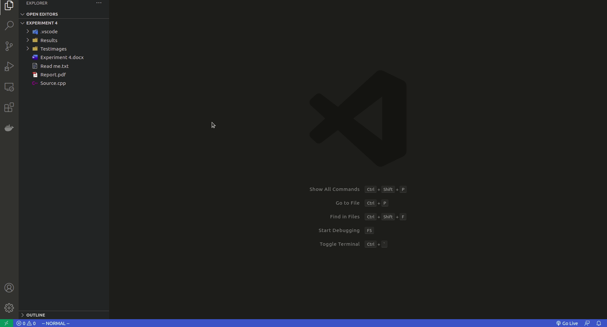

# Gitignore Generator 

Generates .gitignore files using toptal gitignore api

Github Repository Link : https://github.com/sleepingsaint/gitignore-generator

## Requirements

Internet connection - for pulling in the latest files

## Instructions

Go to command pallete using <code>cmd + shift + p</code> and search for <code>generate</code> command

* It looks something like <code>Gitignore Generator: generate</code>
* select the languages you want.

